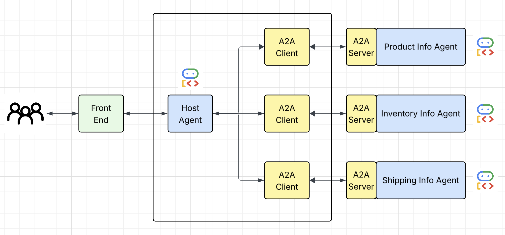

# Multi-Agent Collaboration with Google ADK and A2A 

This repo highlights how to use the agent2Agent (A2A) protocol for multi-agent collaboration,
where multiple agents work together to accomplish a goal. 

The application features 




### Goal:
The goal of this agentic AI framework is to access information from 
different products and inform the user about key product characteristics, 
the product inventory and shipping information. In this example, our Host Agent acts as a customer support agent that 
consumes the Product Information Agent, the Inventory Information Agent and the Shipping information Agent to collect 
information for the uses. The Agentic Development Kit handles the A2A protocol communication and enable our Host Agent to 
communicate seamlessly with the various Agents.


A simple UI for demo how the proposed Agentic-AI framework works
is given below:


### Installation:

1. Install dependencies from pyproject.toml

From the project root:
```shell
uv sync
```

2. In different terminals, access the different agents: [shipping agent](src/agents/shipping_agent), 
   [product agent](src/agents/product_agent) and [inventory agent](src/agents/inventory_agent) and run 
   each agent in different terminal by running:
   
```shell
uv run main.py
```


3. When all agents are running, open a new terminal in [host](src/host) and initiate the host agent by running:

```shell
uv run main_agent.py
```